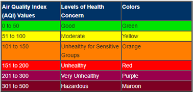
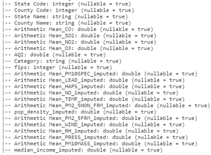
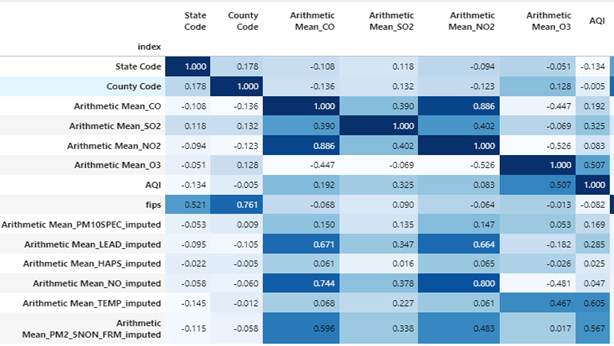
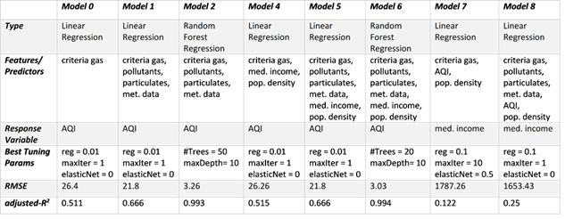
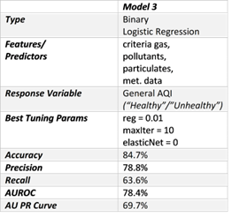
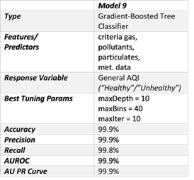

# DS-5110-Big-Data-Final-Project

DS 5110 Final Project Report - Air Quality Group 5
Daniel Heffley (dh3by) 
Camille Leonard (cvl7qu) 
Shahriar Shahrokhabadi (ss3qs)
Stephanie Verbout (sv8jy)

i.	Abstract
Air quality data gathered from EPA monitoring sites at the county-level was examined in an effort to predict the Air Quality Index (AQI) value.  In addition, two socioeconomic factors (median income and population density) were added in an attempt to gain further predictive power. Studies have shown links between obesity, poverty and/or asthma [Reference] due to people living nearby sources of major pollution. Moreover, higher population densities could implicate concentrated areas of manufacturing that would increase pollutants and/or gas emissions over time. 
In the U.S., AQI is measured on a scale of 0 to 500; 500 represents the worst level of air quality. Several variables were considered in our dataset: criteria gases (ground-level ozone concentration (O3), carbon monoxide (CO), sulfur dioxide (SO2), nitrogen dioxide (NO2)), particulate matter (2.5mm and 10mm), toxins (lead, hazardous air pollutants (HAPS), nitric oxide (NO)), and meteorological factors (temperature, relative humidity, pressure, and wind). AQI scores are divided into safety levels so that the public may be informed of the conditions of the air in their area on a daily basis. Below is a chart describing the AQI values and associated health concerns.

Table 1. Air Quality Index Values, Health Concerns, Color Scheme

 
	Ten models were run with varying sets of predictors in order to determine the features that best predicted AQI and median income in the United States. Random Forest (RF) Regression and Gradient-Boosted Tree (GBT) Classifier performed the best when predicting AQI. Median income and population density did not add any predictive power to any of the models. Linear regression models (optimized as a ridge regression) performed satisfactory at predicting both AQI and median income. 
RF model output revealed the relative feature importance of model predictors. It was found that ozone concentration, particulate matter concentration, and temperature were the most important features when predicting AQI from the data set.

ii.	Data and Methods 

Data was aggregated for the years 2017 to 2019 from the Environmental Protection Agency (EPA) Air Data project that samples many variables collected from outdoor monitoring sites across the U.S (https://aqs.epa.gov/aqsweb/airdata/download_files.html#Raw).  U.S. census data was compiled by OpenIntro at the county-level from the most current 2010 U.S. census report (https://www.openintro.org/data/?data=county_complete).  In order to create the final dataset, daily AQI values, criteria gases (ground-level ozone concentration (O3), carbon monoxide (CO), sulfur dioxide (SO2), nitrogen dioxide (NO2)), particulate matter (2.5mm and 10mm), toxins (lead, hazardous air pollutants, nitric oxide (NO)), and  meteorological factors (temperature, relative humidity, pressure, and wind) were assembled.  In addition, county-level socioeconomic data (median income and population density) were included.   
It is important to note that the analysis was not time-series based and three research questions were investigated:
1.	Can daily AQI scores be predicted at county-level in the contiguous U.S. using gas, pollutant, particulate matter and meteorological data?
2.	Can daily AQI scores be predicted at county-level in the contiguous U.S. with gas, pollutant, particulate matter, meteorological data and socio-economic factors?
3.	Can median income be predicted at the county level for counties in the contiguous U.S. with gas, pollutant, particulate matter, meteorological data and population density measures?

Table 2.  Final data set schema. Data set contained 2,650,234 records and 25 features.
 

Data Pre-processing:

First, duplicate records were dropped and it was noted that missing values were present in several features. These features were imputed with median values and in addition.  Outlier detection was performed on the dataset by identifying values using interquartile rule. This was done by the following steps: 

●	Defining the interquartile range:  IQR = Q3-Q1, where Q1 is the first quartile and Q3 is the third quartile. 
●	Multiplying the interquartile range (IQR) by 1.5 (a constant used to discern outliers).
●	Adding 1.5 x (IQR) to the third quartile (Q3). Any number greater than this is a suspected outlier.
●	Subtract 1.5 x (IQR) from the first quartile (Q1). Any number less than this is a suspected outlier.

Outlier values were removed from the dataset. Following outlier detection, missing AQI and Category data were also removed; resulting in 588 records being dropped from the dataset. In order to perform binary response types of models, a new column called ‘General_AQI’ was created for values of 0-100 AQI equal to ‘Healthy’ air quality, and values 100+ AQI were deemed ‘Unhealthy’. 
Upon constructing the data set, a correlation matrix was used to draw preliminary conclusions about the predictors’ correlation with AQI. Possible correlations exist between O3 concentration, temperature, and PM2_5NON_FRM (particulate matter). 

Table 3.  Correlation Matrix

iii.	Results
In total, ten models were tested and evaluated on the data set.  Five models were tested in order to predict AQI without socioeconomic factors, three models were tested with socioeconomic factors included, and two final models were analyzed in an effort to predict median income from the AQI parameters. The data set was split into training (80%) and holdout (20%) data sets. All models used 5-fold cross-validation in order to select the best-tuned models. 
Pipelines were utilized with the exact process depending on the particular model. Pipeline steps included VectorAssembler, StandardScalar (when applicable), VectorIndexer (for RF), and an appropriate call to the modell. For Linear Regression, Binary Logistic Regression, and Gradient-Boosted Tree (GBT) Classifier models, a standard-scaler was used to scale the predictors before model training. For RF models, no feature scaling was performed; only  feature indexing before model training.

Table 4.  Models 0 - 2, 4 - 8 Information and Performance Metrics 
 

To initialize the base-line model (model 0), Linear Regression with an intercept was fit to criteria gas data only (CO, SO2, NO2 and O3). Fifty-four iterations were tested within a parameter grid and Ridge Regression performed best.  Once applied to the holdout data, the adjusted-R2 = 0.511 and minimized root mean-squared error (RMSE) equaled 26.4.
Next, model 1 fit a Linear Regression to the data but added pollutant, particulate matter and meteorological features. This model was an improvement over the base-line model and reduced the RMSE to 21.8 and an adjusted-R2 = 0.666.  Model 2 used the same features as Model 1, but fit a Random Forest (RF) Regression model. This performed the best and reduced the RMSE to 3.26 and adjusted-R2 = 0.993.  In addition, the most important features were shown to be 2.5mm particulate matter, temperature and ozone concentration.  
In model 3, Binary Logistic Regression was fitted to a binary response variable of “Healthy” or “Unhealthy” AQI.  The model performed well with an area under the ROC curve = 0.784, 85% accuracy, and 79% precision on the holdout data. 

Table 5.  Model 3 Information and Performance Metrics 

 
Following the initial model evaluation using criteria gas, pollutant, particulate matter and meteorological factors, socioeconomic features ‘median income’ and ‘population density’ were included in subsequent models. Model 4 utilized linear regression on only criteria gases, ‘median income’ and ‘population density’.  RMSE was only reduced slightly to 26.24 and adjusted-R2 = 0.511.  This suggests that the socioeconomic data will probably not improve the  predictive power.  In model 5, linear regression with all available data similarly achieved only miniscule improvements over model 1 without the socioeconomic factors. Model 6 was Random Forest again with all features and had a slight improvement in RMSE (3.14) and adjusted-R2 = 0.993.
Model 7 attempted to predict median income by fitting a linear regression model to criteria gas, AQI and population density.  As expected, this performed quite terribly (RMSE = 1783.1 and adjusted-R2 = 0.127) and it is apparent these features do not help predict median income.  Then, all of the features (criteria gas, pollutants, particulate matter, meteorological data, population density) were used to predict median income for model 8.  Similarly, RMSE was only reduced slightly (1653.4) and adjusted-R2 = 0.25.  This reinforced the hypothesis that criteria gas, pollutants, particulate matter, meteorological data and population density do not do well in predicting median income at county level in the U.S.
A final attempt was made to predict “healthy” or “unhealthy” AQI with a Gradient-Boosted Tree (GBT) Classifier (model 9). A GBT Classifier was fit to criteria gas, pollutant, particulate matter and meteorological factors (no socio-economic factors included). This model performed nearly perfectly, with an area under ROC curve = 0.999, 99.9% accuracy, and 99.9% precision on the holdout data. 

Table 6.  Model 9 Information and Performance Metrics 
 

iv.	Conclusions     

Regarding the first research question, (Can daily AQI scores be predicted at county-level in the contiguous U.S. using gas, pollutant, particulate matter and meteorological data?), a conclusion was reached that the adjusted-R2 value for model 0 and model 1 were not high enough to satisfactorily predict the daily AQI scores. Model 0’s score was 0.511 and model 1’s score was 0.666. While an adjusted-R2 value is just one metric, the Linear Regression models did not perform nearly as well as RF (model 2). The RMSE and adjusted-R2 values for model 2 were both nearly perfect. This suggests that the features the RF pinpointed as being most important, namely 2.5mm particulate matter, temperature and ozone concentration, were excellent predictors of daily AQI scores. The RF approach far outperformed the linear models because RF was able to minimize the importance of the features that did not contribute to AQI. Model 3’s approach of using Binary Logistic Regression to predict a high or low AQI yielded an area under the ROC curve of 0.784. This was considered a good result, though it is not comparable with model 2’s nearly perfect adjusted-R2 value.
	Regarding the second research question, (Can daily AQI scores be predicted at county-level in the contiguous U.S. with gas, pollutant, particulate matter, meteorological data and socio-economic factors?), it was observed that adjusted-R2 values for models 4 and 5 did not improve when the socio-economic factors were added to the model. Models 4 and 5 were fit with the same predictors as models 0 and 1, respectively, with median income and population density predictors added.  Therefore, models 0 and 4 and models 1 and 5 can be compared quite easily. Models 4 and 5 lead us to believe that the socio-economic data did not help predict daily AQI values. This may be somewhat surprising as socio-economic data often correlates with health outcomes, but in this case it did not correlate appreciably with air quality in the data set. Model 6 used a RF Regression to predict AQI, and much like model 2, had a very high adjusted-R2 value. RF models were once again the highest-performing model for research question 2.
	Regarding the third research question, (Can median income be predicted at the county level for counties in the contiguous U.S. with gas, pollutant, particulate matter, meteorological data and population density measures?), model 7 and 8 produced very low adjusted-R2 values. This result was not necessarily unexpected, but the fact that the adjusted-R2 values were below 0.3 is surprising as that is akin to median income having a random relationship with the predictors. The results of the third research question do contrast well with the results of the first research question however. Models 0 and 1 were also Linear Regression models (when tuned as Ridge Regression) using the same data except for the fact that the response variable was AQI.  As a result, AQI can be predicted much more reliably than socio-economic data.
	While the models overall did not have objectively high metrics when it came to predicting AQI or median income, the decision tree type models did perform the best. This indicates that AQI can be predicted using a reduced number of predictors rather than all the data that is available. The fact that the Linear Regression models and Binary Logistic Regression models did not perform well indicates there was data in the model adding noise to the prediction. Decision tree classifiers were able to clearly identify very well what was important and what was not. 

AQI is calculated using some of the measurements that are in the data set. It is a function of many features, including pollutant concentrations and particulate matter. Thus, a high degree of accuracy in predicting AQI should be expected. What may be more interesting about these findings are the features in the RF model that were marked as most important. While particulate matter and ozone concentration are considered in the AQI scores, temperature is not.  Temperature was still found to be one of the most important features in predicting AQI in RF models. This may be a point of further research. 
	Another point of further research may be to take the features found to be most important in the RF model and run the other models using just those features. This could improve the performance of the other models in predicting AQI and median income. It may be especially impactful for the median income prediction as those models did not perform well. The median income variable is correlated with other predictors in the data set. Therefore, a reduced feature set may remove multicollinearity that may have contributed to the poor performance of some models. 
	The RF models and GBT Classifier are useful in their current forms. Throughout the course of the research, there were many missing values in data found. Not all weather stations had all of the equipment available to record every pollutant. As there are many data points that do not have all of the pollutant data available to us, the RF model (or decision tree classifiers in general) could be helpful in helping predict AQI in these cases. As the relative feature importance is known, missing values may be imputed and assigned AQI scores in cases where not all pollutant values were sampled and recorded. As the model assigned feature importance to predictors that are not used in calculating the AQI, the RF model should be instructive in predicting future AQI’s for incomplete weather readings.
	Future work would include further exploration of models fit with predictor subsets and other modeling techniques such as xgBoost, catBoost, and further exploration of ensemble methods like bagging and boosting. Additionally, other publicly available data from the census and perhaps remote sensing sources could be added to further improve the predictive performance of median income. 
	

	
